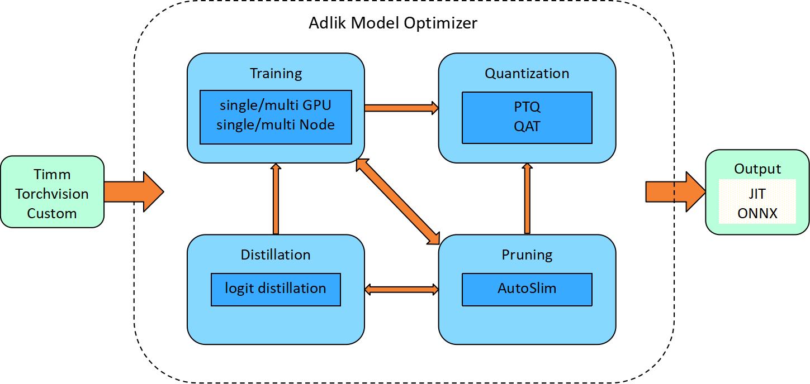
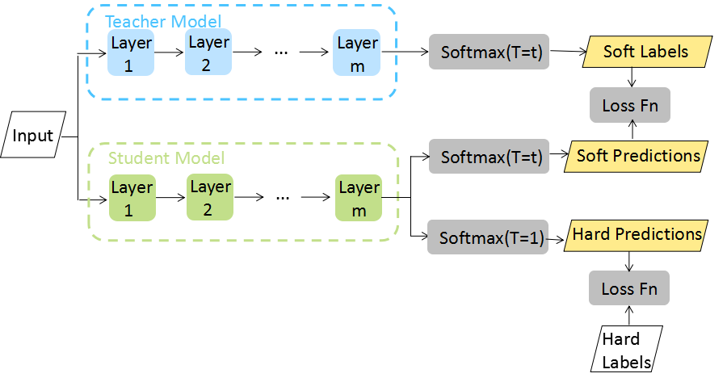
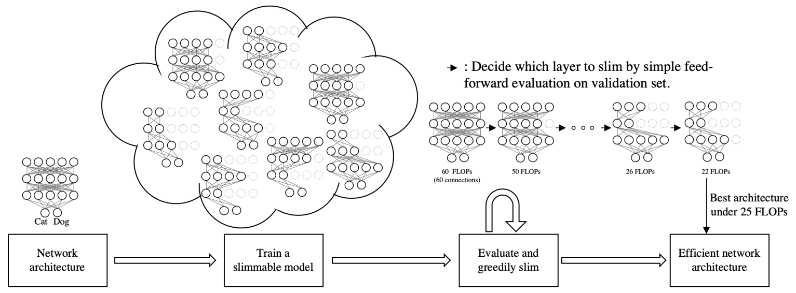

# Model Optimizer

[](https://dev.azure.com/Adlik/GitHub/_build/results?buildId=3472&view=results)
[](https://app.bors.tech/repositories/65566)
[](https://opensource.org/licenses/Apache-2.0)

Model Optimizer mainly focuses on model optimization, currently supporting model training, quantization, distillation,
and pruning. For convenience, we provide different configuration files to support the above abilities. Users only need
to use the default configuration or change the configuration file according to specific needs to realize the
optimization of the model. It can be used quickly without knowing the implementation details. The four optimization
methods will be described below.



We tested the PTQ(Post Training Quantization) quantization of different models and used FakeQuantize in PyTorch to
count the quantization data, where the observer uses minmax and percentile. The table below shows the test results
of the models. Note that activations use the same observer as weights unless otherwise noted.

|   models\infer acc    |       FP32         |           JIT(minmax)         |      TVM (minmax)        |         TensorRT(act=percentile,weight=minmax)      |
|        :---:          |     :-----:         |          :------:                 |      :--------:        |        :-----:      |
|       resnet18        |      69.758         |           69.274                  |        69.500          |         69.56       |
|       resnet50        |      76.13          |           75.580                  |        75.612          |         75.99       |
|       mobilenetv2     |      71.878         |      70.730(act=percentile)       |        70.816          |         71.11       |

For AutoSlim, we give the pruning effect of the resnet50 model on the ImageNet dataset.

| FLOPs(G)  |Params(M)  |Size(MB)|  Top-1| Acc  |Input Size|
|:---:|  :---: | :---: | :---: | :---: | :---: |
|ResNet5  |4.12 |25.56  |98 |77.39% |224|
|ResNet-50 0.75×  |2.35 |14.77  |57 |75.87% |224|
|ResNet-50 0.5× |1.07 |6.92|  27| 72.75%  |224|
|ResNet-50 0.35×  |0.56 |3.57 |14 |69.05% |224|
|AutoSlim-ResNet-50 |3.04(-26.2%) |23.17| 89  |77.53%(+0.14%) |224|
|AutoSlim-ResNet-50 |2.03(-13.6%) |18.95| 73  |75.77%(-0.1%)  |224|
|AutoSlim-ResNet-50 |1.02(-4.7%)  |10.24| 39  |73.16%(+0.41%) |224|
|AutoSlim-ResNet-50 |0.59(+5.4%)  |6.70|  26  |70.90%(+1.85%) |224|

The following table shows the effect of AutoSlim on YOLOv5m backbone pruning.

| FLOPs(G)  |Params(M)  |Size(MB)|mAPval 0.5:0.95|  Input Size|
| :---: | :---: | :---: | :---: | :---: |
|YOLOv5m  |24.5 |21.2 |81 |44.4 |640|
|AutoSlim-YOLOv5m | 16.7(-31.8%)| 17.8(-16%)| 69(-14.8%)| 42.0(-2.4)| 640|

In addition, we tested the time consumption of ResNet50 using the AutoSlim algorithm on 8 x v100 GPUs using different methods.

|steps| baseline spend time(hours)| apex spend time(hours)| apex,96×96 spend time(hours)  |Input Size|
| :---: | :---: | :---: | :---: | :---: |
|supernet training  |28|  17.4(-37.9%)| 6.25(-77.7%)| 96|
|searching sub-network  |113  |73(-35.4%)|  43.75(-61.3%)|  96|
|AutoSlim-ResNet-50-3G |retrain | 11.8  |9.8(-16.9%)  |9.8(-16.9%)  |224|
|AutoSlim-ResNet-50-1G |retrain |9.8  |9.8(0%)  |9.8(0%)  |224|

## Support features

### 1.1 Training

The framework provides an easy model training solution and supports the training of Timm, TorchVision,
and custom models. To speed up training, we also support model training on a single node that has multiple GPUs
or multiple nodes.

### 1.2 Quantization

Quantization can significantly compress the size of the model. This framework supports model PTQ and
QAT(Quantization Aware Training) quantization and provides PyTorch FX quantization and
[LSQ](https://arxiv.org/abs/1902.08153)(Learned Step Size Quantization) quantization. It should be
noted that the PTQ quantization we provide is different from that of PyTorch. Instead of using an observer,
we use the same FakeQuant as QAT quantification to count the quantized parameters and simulate the PTQ
quantization process. To support inference on multiple backends, we perform additional processing on the
model based on PyTorch FX. The prepare and convert functions in PyTorch are encapsulated, the quantized
model is supported to export the ONNX model, and inference evaluation is performed on TVM/TensorRT.
Currently, when the backend is TORCH_FBGEMM, TORCH_QNNPACK, or TVM, JIT, and ONNX models can be exported
at the same time, which two types of models can be performed on TVM; when the backend is TORCH_TENSORRT,
the model will be only exported as ONNX. We also provide scripts for inference on TVM/TensorRT in the tools folder.

You can use the following observers in the prototxt configuration:

- minmax
- moving_average_minmax
- percentile

A simple code example is provided below.

```python
1. model = get_model_from_source(...)  or CustomModel

2. model = prepare_fx_with_backend(model, ...)

3. PTQ/QAT quantization,  model calibration, or training

4. convert_model_by_backend(model, ...)

5. evaluate the model on TVM/TensorRT/PyTorch
```

### 1.3 Knowledge Distillation

Knowledge distillation is a compression technique by which the knowledge of a larger model(teacher)
is transferred into a smaller one(student). During distillation, a student model learns from a teacher
model to generalize well by raising the temperature of the final softmax of the teacher model as the
soft set of targets. Besides, the quantized model may suffer from an accuracy drop, distillation is
a suitable method to improve the quantized model performance.



Refer to the paper [Distilling the Knowledge in a Neural Network](https://arxiv.org/abs/1503.02531)

### 1.4 Pruning

AutoSlim can prune the model automatically, which it can achieve better model accuracy under
limited resource conditions (such as FLOPs, latency, memory footprint, or model size)。In AutoSlim,
it can be divided into several steps. The first step is to train a slimmable model for a few epochs
(e.g., 10% to 20% of full training epochs) to quickly get a benchmark performance estimator; Then we
evaluate the trained slimmable model and greedily slim the layer with minimal accuracy drop on a
validation set. After this single pass, we can obtain the optimized channel configurations under
different resource constraints. Finally, we train these optimized architectures individually or jointly
(as a single slimmable network) for full training epochs.

We also tried several ways to optimize AutoSlim:

- reducing input size
- mixed precision training



Refer to the paper [AutoSlim: Towards One-Shot Architecture Search for Channel Numbers](https://arxiv.org/abs/1903.11728)

## 2. Installation

We provide two ways to use model_optimizer.

### 2.1 Use Docker file

Currently, we only provide the docker file for the GPU. For detailed usage, please refer to the [tutorial](https://docs.docker.com/get-started/overview/).

### 2.2 Clone Adlik model optimizer

Clone the Adlik model optimizer code repository from GitHub:

```sh
git clone https://github.com/Adlik/model_optimizer.git
```

#### 2.2.1 Install the package

##### 2.2.1.1 Install Protoc

For detailed installation instructions, please reference the [official document](https://github.com/protocolbuffers/protobuf).

##### 2.2.1.2 Install the Python package

```sh
python -m pip install -r requirements.txt
```

##### 2.2.1.3 Project environment setup

There are two installation methods.

1、Python wheel installation

```sh
cd  model_optimizer
python setup.py install
```

2、Developer mode installation

```sh
chmod +x *.sh
source setup.sh
```

## 3. Usage

The framework supports model training, quantization, distillation, and pruning, by configuring different
prototext files. The prototext file needs to provide the main_file path of the corresponding above abilities.
In the folder of examples, there are many experimental prototext config files.

Basic usage command:

```sh
./run_cli.sh "your prototext file path"
```

The following will supply the detailed prototext configurations.

### 3.1 Model Training

Single node configuration is as follows:

```protobuf
main_file: "examples/classifier_imagenet/main.py"
arch: "resnet50"
model_source: TorchVision
log_name: "multi_gpu"
debug: false
data: "/data/imagenet/imagenet-torch"
lr: 0.1
epochs: 90
batch_size: 256
workers: 8
print_freq: 50
evaluate: false
pretrained: false
seed: 0
gpu_id: ANY
multi_gpu {
  world_size: 1
  rank: 0
  dist_url: "tcp://127.0.0.1:23457"
  dist_backend: "nccl"
  multiprocessing_distributed: true
}

warmup {
  lr_warmup_epochs: 5
  lr_warmup_decay: 0.01
}

lr_scheduler: CosineAnnealingLR

optimizer: SGD
sgd {
  weight_decay: 1e-04
  momentum: 0.9
}
```

For multiple hosts, you can reference the examples:

```sh
examples/classifier_imagenet/prototxt/resnet/resnet50_train_multihost_multi_gpu_consine_b256_lr0.1_host*.prototxt
```

### 3.2 Model quantization

The project support PTQ(Post Training Quantization) and QAT(Quantization Aware Training).

The typical PTQ quantization configuration.

```protobuf
pretrained: true
quantization {
  quantize: true
  quantize_fx: false
  post_training_quantize: true
  backend: TORCH_FBGEMM
  num_calibration_batches: 120
  activation_quantization_observer {
    quantization_method: "quantization_error"
    per_channel: false
    symmetric: false
    reduce_range: true
    dtype: "quint8"
  }
  weight_quantization_observer {
    quantization_method: "minmax"
    per_channel: true
    symmetric: true
    reduce_range: false
    dtype: "qint8"
  }
}
```

The typical QAT quantization configuration.

```protobuf
pretrained: true
quantization {
  quantize: true
  quantize_fx: false
  post_training_quantize: false
  backend: TORCH_FBGEMM
  num_observer_update_epochs: 4
  num_batch_norm_update_epochs: 99999
  activation_quantization_observer {
    quantization_method: "moving_average_minmax"
    per_channel: false
    symmetric: false
    reduce_range: true
    dtype: "quint8"
  }
  weight_quantization_observer {
    quantization_method: "moving_average_minmax"
    per_channel: true
    symmetric: true
    reduce_range: false
    dtype: "qint8"
  }
}
```

For the detailed configuration please refer to the config path.

```sh
PTQ quantization: examples/classifier_imagenet/prototxt/resnet/resnet50_quantization_ptq.prototxt

QAT quantization: examples/classifier_imagenet/prototxt/resnet/resnet50_quantization_qat.prototxt
```

If the accuracy loss is large after the model is fully quantized, you can enable mixed-precision quantization to
provide your target accuracy. The related configuration items are as follows.

```protobuf
sensitivity_analysis {
  sensitivity_type: ONE_AT_A_TIME_ACC
  target_metric: 69.6
  metric_big_best: true
}
```

### 3.3 Model Distillation

When using distillation, you have to config the teacher model, and the loss ratio of teacher and student.
Such as distilling the resnet50, you can refer to the configuration:

```sh
examples/classifier_imagenet/prototxt/distill/resnet50d_distill_resnet50.prototxt
```

The main distillation parameters are as follows:

```protobuf
distill {
  teacher_model {
    arch: "resnet50d"
    source: Timm
  }
  kl_divergence {
    temperature: 1.0
    reduction: "batchmean"
    loss_weight: 0.7
  }
}
```

### 3.4 Model AutoSlim auto-optimization

AutoSlim method has three steps to get the optimized model:

- Firstly train a supernet. The config file path:

```sh
examples/classifier_imagenet/prototxt/resnet/resnet50_autoslim_supernet.prototxt
```

- Then search sub-network in supernet.

```sh
examples/classifier_imagenet/prototxt/resnet/resnet50_autoslim_search.prototxt
```

- Finally finetune sub-network.

```sh
examples/classifier_imagenet/prototxt/resnet/resnet50_autoslim_retrain_100epochs_lr0.4_decay5e05_momentum0.9_ls0.1.prototxt
```

## Acknowledgement

We would like to thank them for their excellent open-source work.

- [EfficientPyTorch](https://github.com/hustzxd/EfficientPyTorch)
- [MQBench](https://github.com/ModelTC/MQBench)
- [mmrazor](https://github.com/open-mmlab/mmrazor)

## License

This project is released under the Apache 2.0 license.
